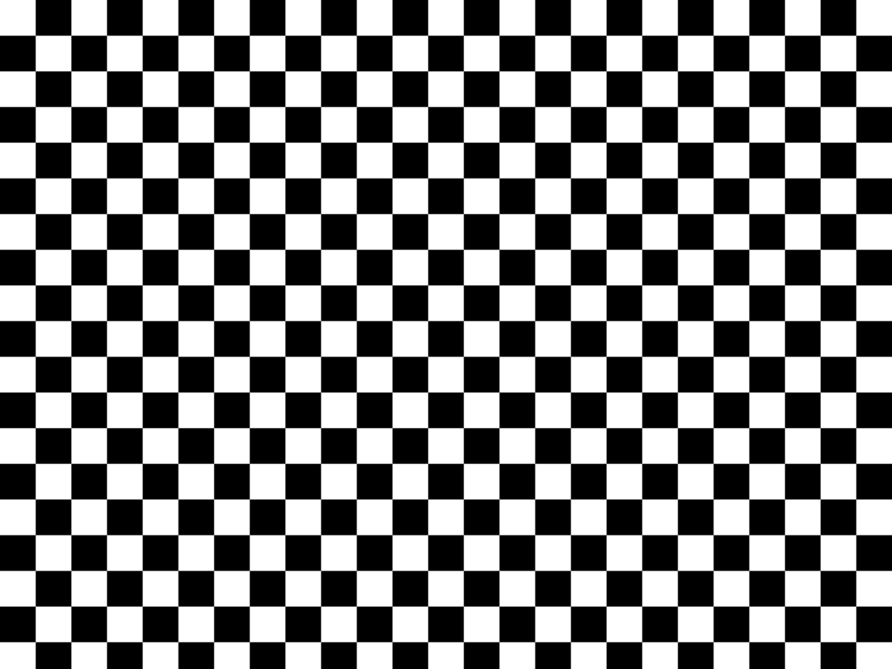
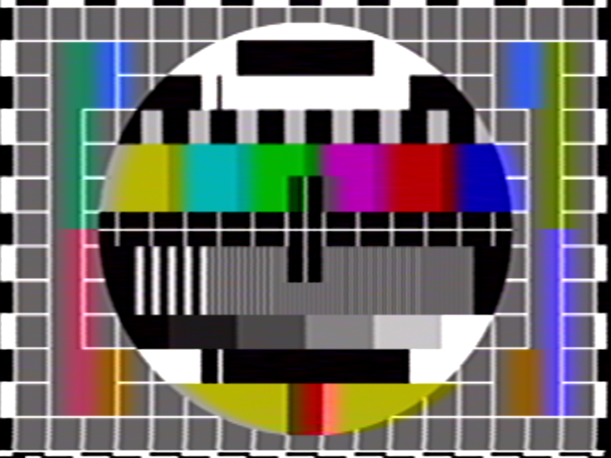
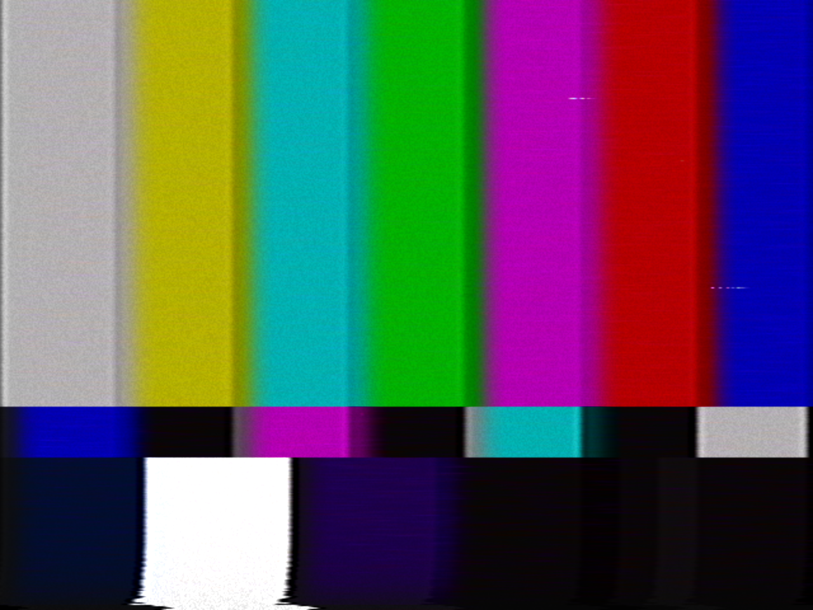
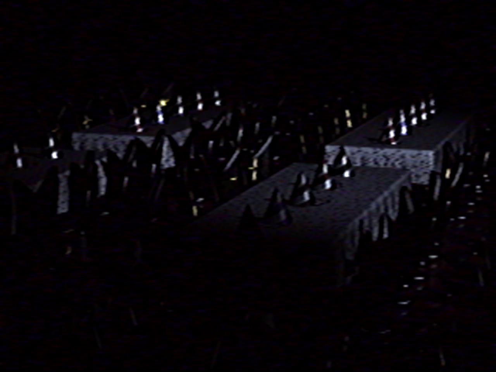
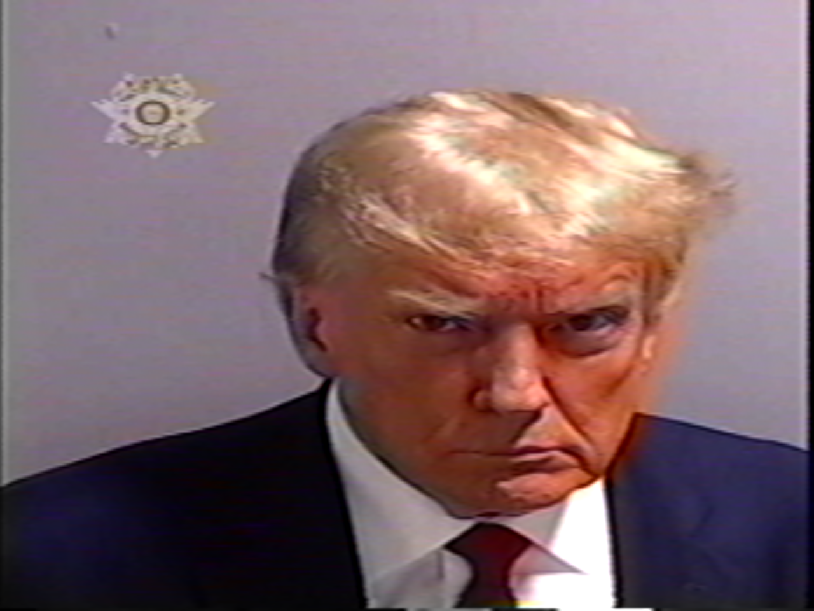
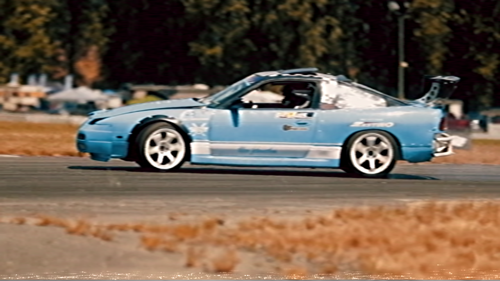
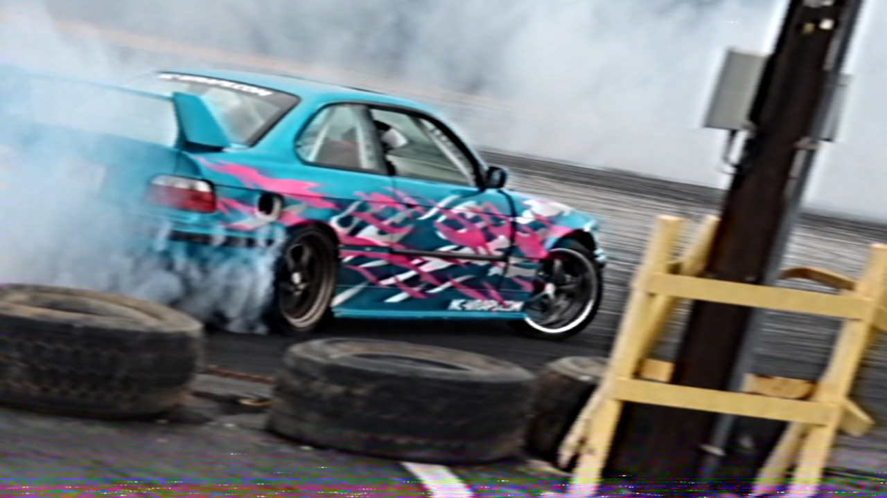
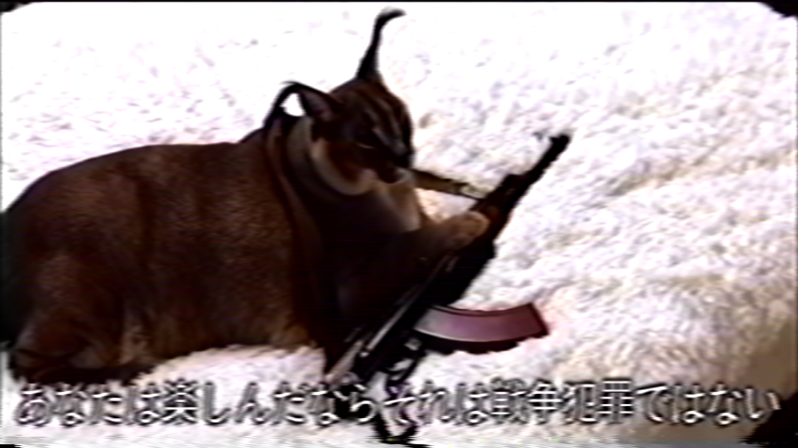
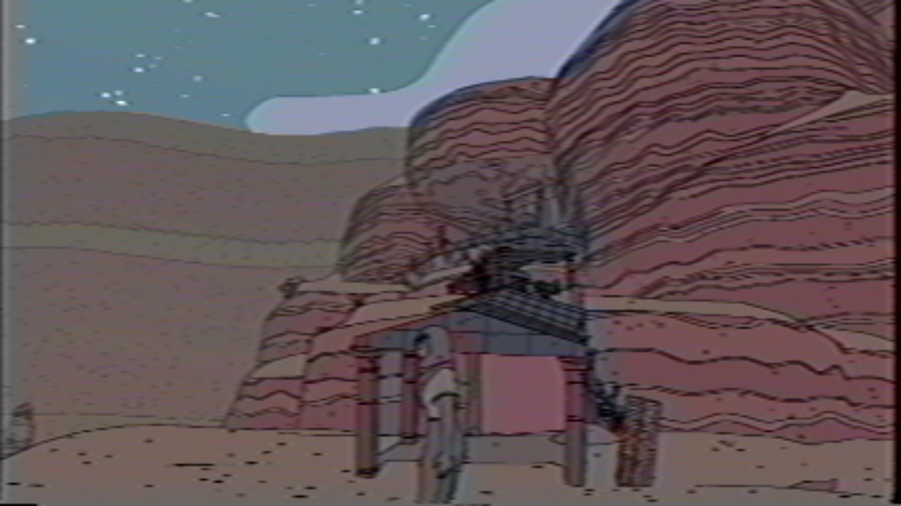
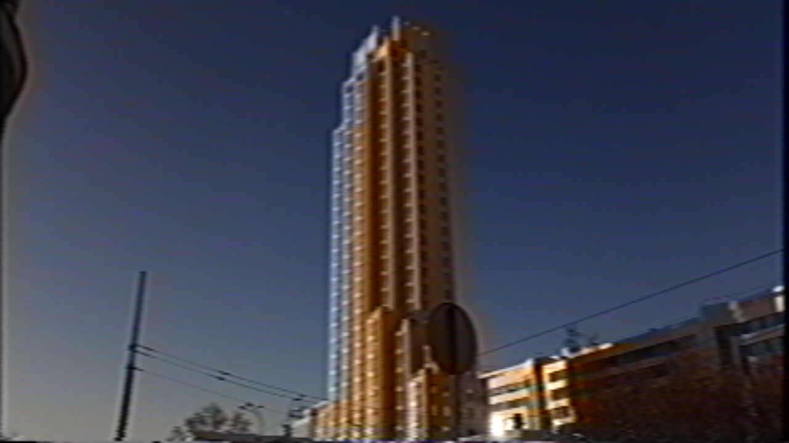

# RITEG
Realtime-ish Image Transforming Enhanced with OpenGL  

* [YouTube VHS effect (v2) demo](https://www.youtube.com/watch?v=AqyeJKgVvjk)  

    

* [YouTube VHS effect (v3) demo](https://www.youtube.com/watch?v=YYPVdMJoNWc)  

    

# Documentation
* [Building](docs/00_building.md)
* [Command line usage](docs/01_commandline.md)
* [JSON format](docs/02_json_format.md)
* [Shader copypasta](docs/03_shader_copypasta.md)
* [Tips and Tricks](docs/04_tips_and_tricks.md)

# Examples (4:3, checker.json)
  

# Examples (4:3, vhs.v3.json)
  
  
  
  
  

# Examples (16:9, vhs.v3.json)
  
  
  
  
  
  
