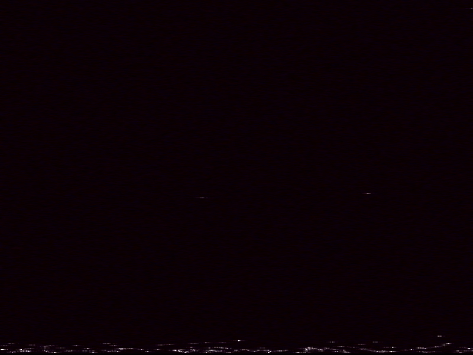
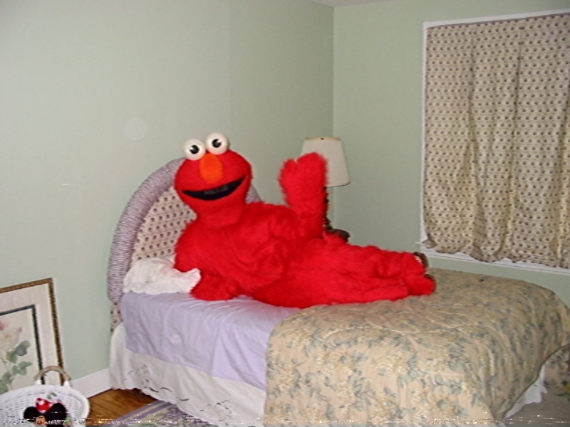
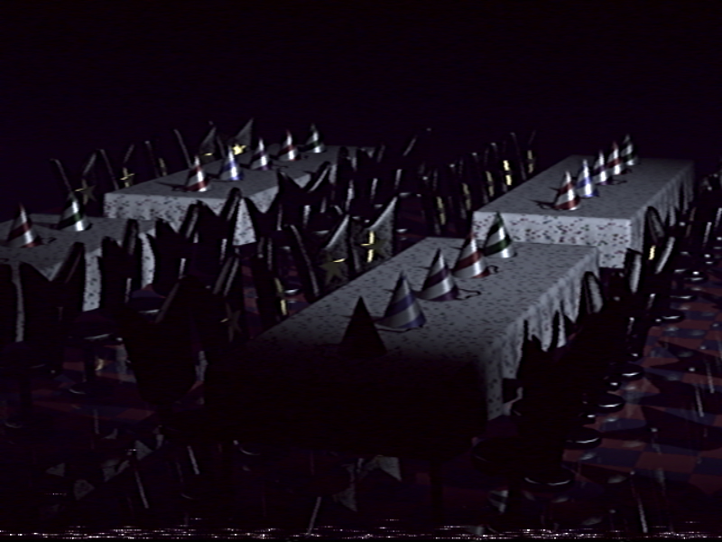
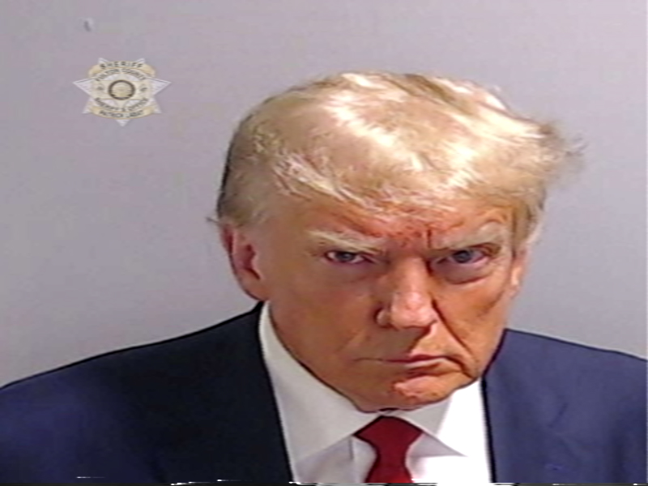
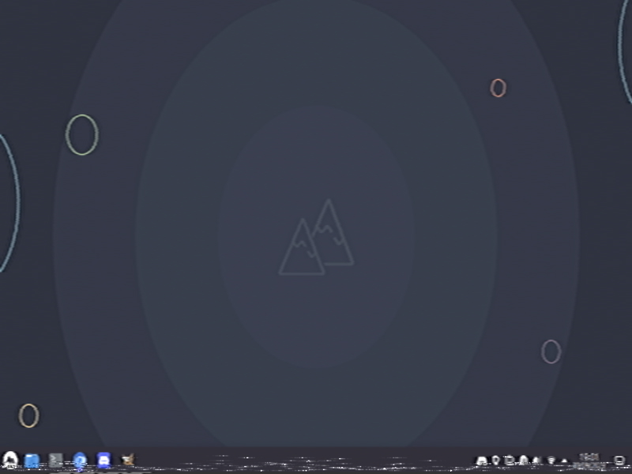
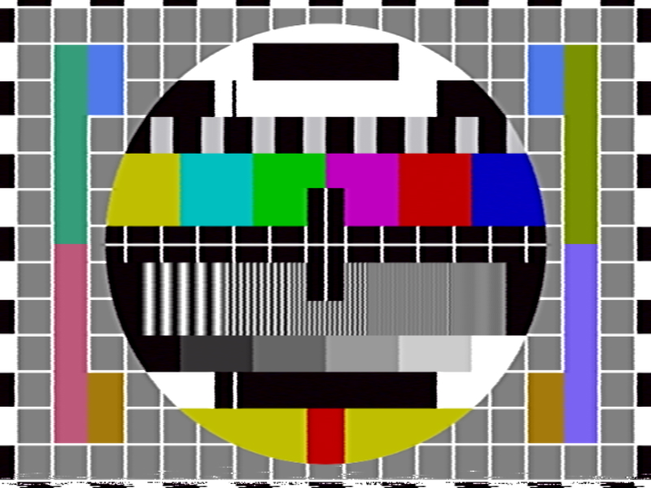

# RITEG
Realtime-ish Image Transforming Enhanced with OpenGL  

* [YouTube VHS effect (v2) demo](https://www.youtube.com/watch?v=AqyeJKgVvjk)  

    

# Documentation
* [Building](https://github.com/untodesu/riteg/wiki/Building)
* [Command line usage](https://github.com/untodesu/riteg/wiki/Command-line-usage)
* [JSON format](https://github.com/untodesu/riteg/wiki/JSON-format)
* [Shader copypasta](https://github.com/untodesu/riteg/wiki/Shader-copypasta)

# Examples (vhs.v3.json)
  
  
  
  
  
  
  

# Example (checker.json)
  
