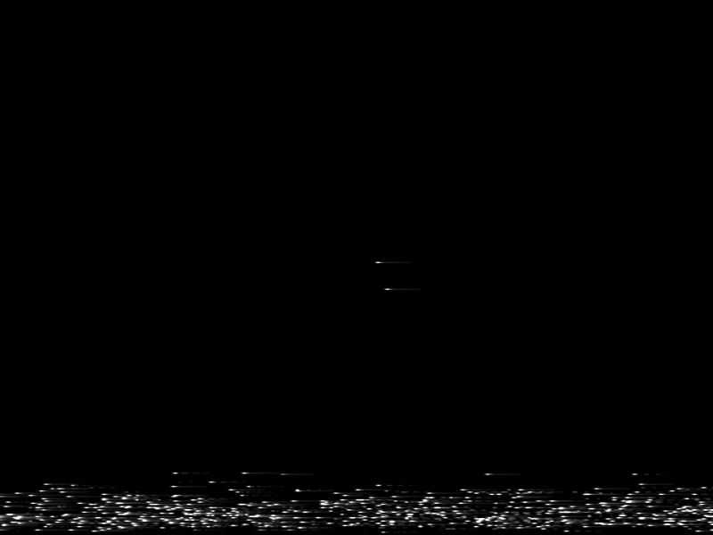
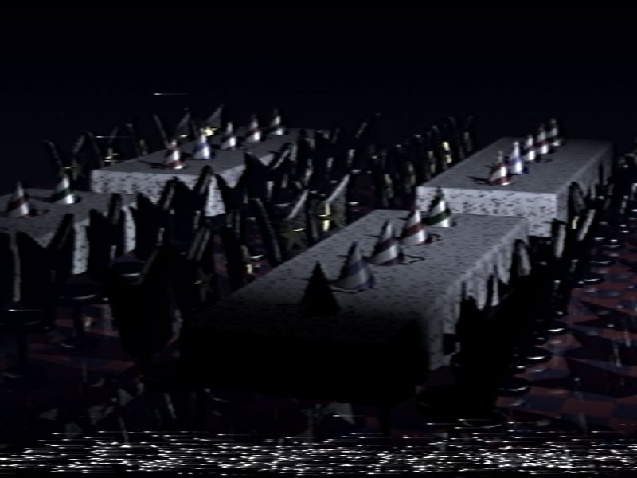
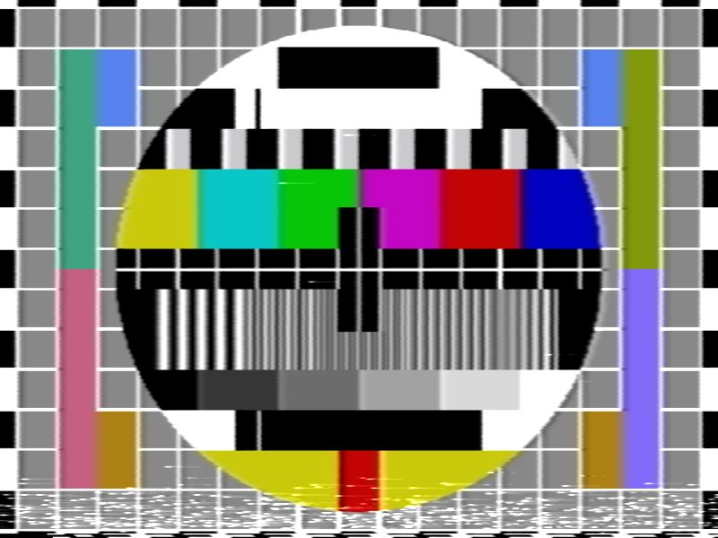
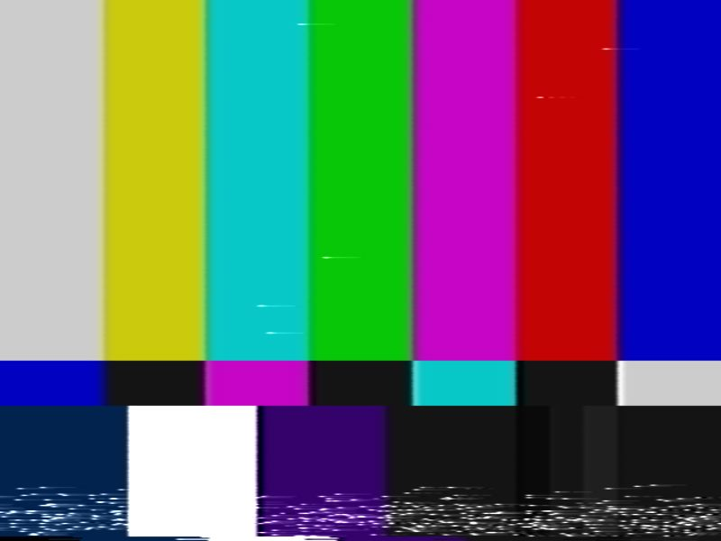
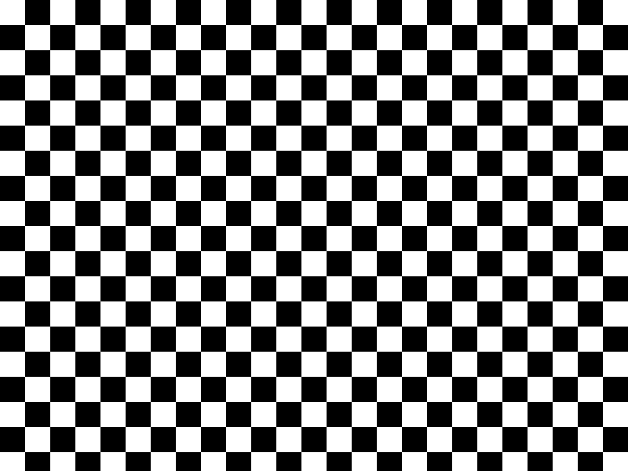

# RITEG
A realtime-ish GLSL image processor

# CLI usage:
```
usage: riteg [-B] [-o <prefix>] [-L <count>] [-F <fps>] [-Q <qval>] [-s <W>x<H>] <pipeline> [path...]
flags:
  -B          : Set batch mode, treat prefix as a dirname
  -o <prefix> : Set output file prefix (directory in batch mode)
  -L <count>  : Specify maximum amount of frames to render
  -F <fps>    : Specify the fixed framerate
  -Q <qval>   : Specify export JPEG quality (0..100)
  -s <W>x<H>  : Set window size (makes it non-resizable)
  <pipeline>  : Set the JSON pipeline
  [path...]   : Load image/images
```

# Processing videos
* Split video to frames (`ffmpeg -i <video> input/%d.png`)
* Batch-process frames (`riteg -B -o output ... <pipeline> $(ls -v input/*.png)`)
* Construct the video back (`ffmpeg -i output/%d.png -vcodec libx264 -crf 25 output.mp4`)

# Requirements (normal systems)
* A GPU
* GPU drivers that comprehend OpenGL 4.5
* [GLFW](https://www.glfw.org/)

# Requirements (Windows)
* Tons of luck and WSL or whatever the hell windows users have these days

# Building
```
make all
```

# Cleaning
```
make clean
```

# Installing
  

# Examples (vhs.v2.json)
  
  
  
  
  

# Example (checker.json)
  
