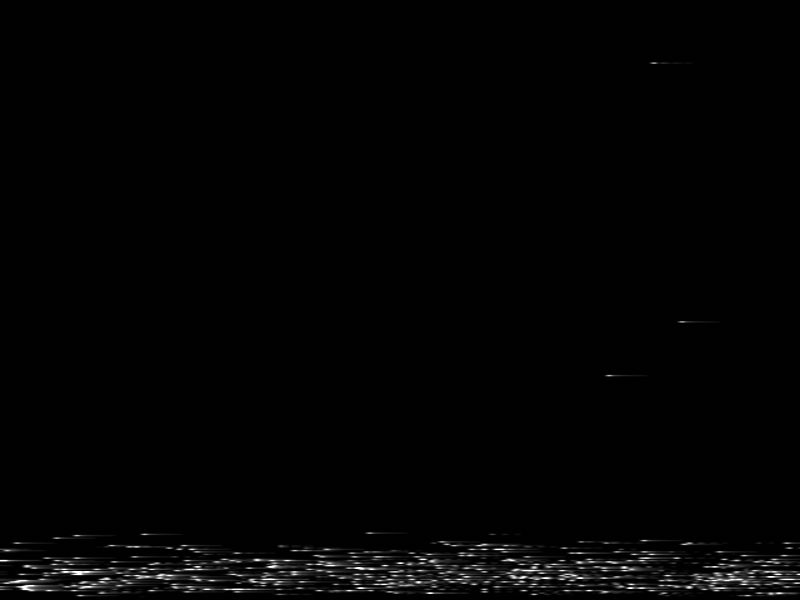
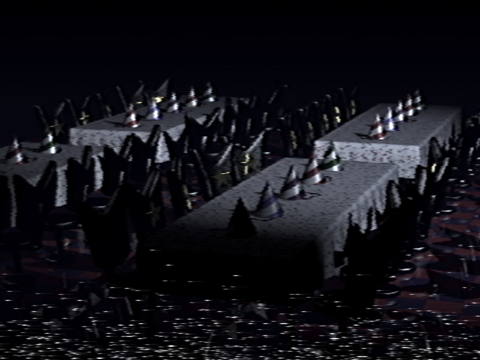

# RITEG
A realtime data-driven image processor

# CLI usage:
```
usage: riteg [-B] [-o <prefix>] [-L <count>] [-F <fps>] [-Q <qval>] [-s <W>x<H>] <pipeline> [path...]
flags:
  -B          : Set batch mode, treat prefix as a dirname
  -o <prefix> : Set output file prefix (directory in batch mode)
  -L <count>  : Specify maximum amount of frames to render
  -F <fps>    : Specify the fixed framerate
  -Q <qval>   : Specify export JPEG quality (0..100)
  -s <W>x<H>  : Set window size (makes it non-resizable)
  <pipeline>  : Set the JSON pipeline
  [path...]   : Load image/images
```

# Examples (vhs.json)
  

  
  
