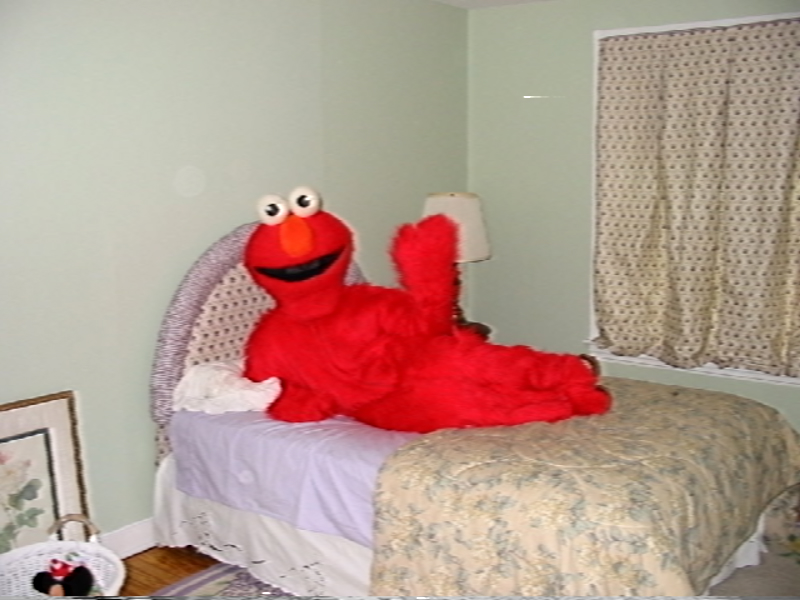

# RITEG
Realtime-ish Image Transforming Enhanced with OpenGL

# Documentation
* [Building](https://github.com/untodesu/riteg/wiki/Building)
* [Command line usage](https://github.com/untodesu/riteg/wiki/Command-line-usage)
* [JSON format](https://github.com/untodesu/riteg/wiki/JSON-format)
* [Shader copypasta](https://github.com/untodesu/riteg/wiki/Shader-copypasta)

# Examples (vhs.v2.json)
  
  
  
  
  
  

# Video examples (vhs.v2.json) (click on the images)

# Example (checker.json)
  
