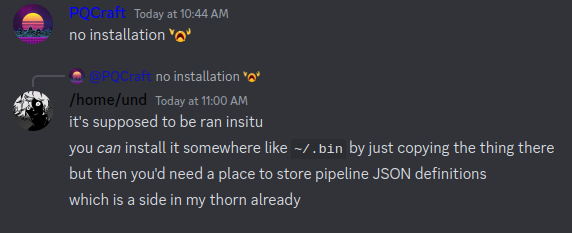

# Building RITEG
### Requirements (normal systems)
* A GPU
* An ISO C99 compliant C compiler
* GPU drivers that comprehend OpenGL 4.5
* [GLFW](https://www.glfw.org/)
* [FFmpeg](https://ffmpeg.org/)

### Requirements (Windows)
* Tons of luck and WSL or whatever the hell windows users have these days

### The process
```
make all
```

### The cleanup
```
make clean
```

### Installation

