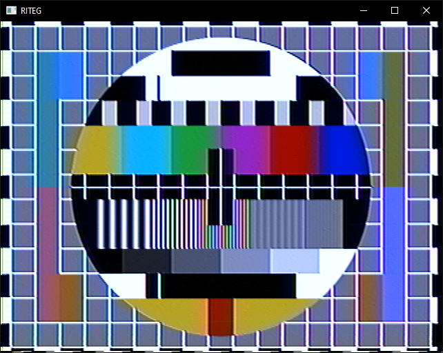

# Running RITEG.V2
```
riteg <project> [parameters] [project-defined parameters]
```

## All hard-coded command-line options
- `-loader <oneshot|sprintf|fsiter>` Specify which way frames are fetched  
- `-ipath <path>` For `oneshot` and `fsiter` loaders only; in case of `oneshot` specifies input file to load from, in case of `fsiter` specifies a directory to iterate through  
- `-iformat <format>` For `sprintf` loader only. Specifies an sprintf format string to load stuff through. Must contain at least one `%d`-ish entry, otherwise it's going to act undefined-behaviourly  
- `-imaxframes <count>` For `sprintf` loader only. Specifies maximum amount of frames to load. Can be omitted for the loader to read until first failure  
- `-saver <oneshot|sprintf>` Specify which way frames are saved  
- `-opath <path>` For `oneshot` saver only. Specifies output file to save into. Required by the loader  
- `-oformat <format>` For `sprintf` saver only. Specifies an sprintf format string to save stuff through. Must contain at least one `%d`-ish entry, otherwise it's going to act undefined-behaviourly. Required by the loader  
- `-omaxframes <count>` For `sprintf` saver only. Specifies maximum amount of frames to save. Required by the loader  

## Examples
### Example 1: VHS - SMPTE bars
```
riteg project/vhs.V8.lua -loader oneshot -ipath media/vhs43.01.png
```
```
  

### Example 2: VHS - blank screen
```
riteg project/vhs.V8.lua
```

  

### Example 3: example project
```
riteg project/example.lua
```
