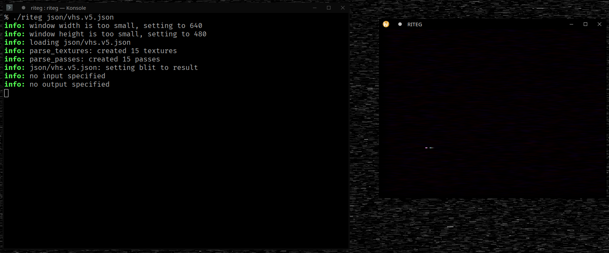
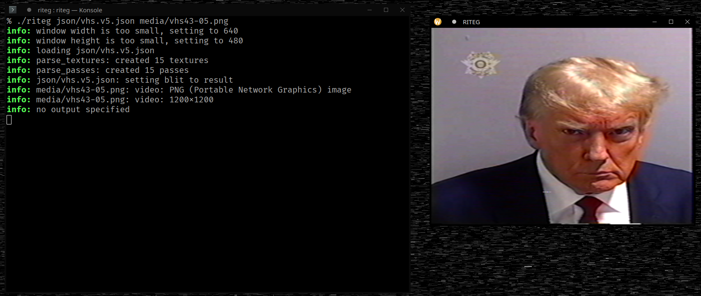
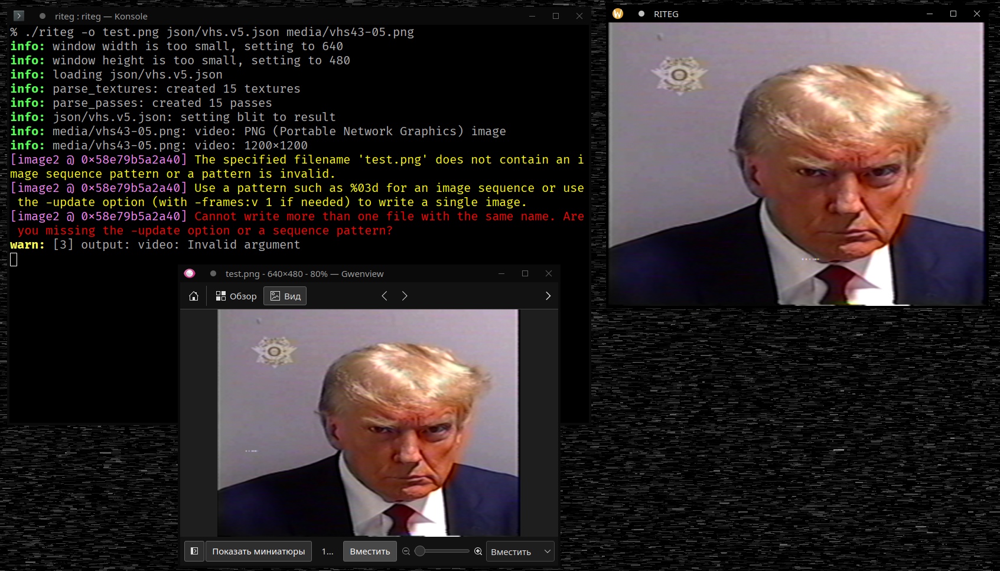
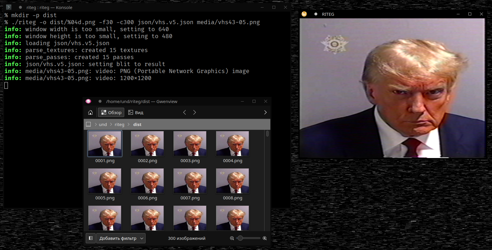
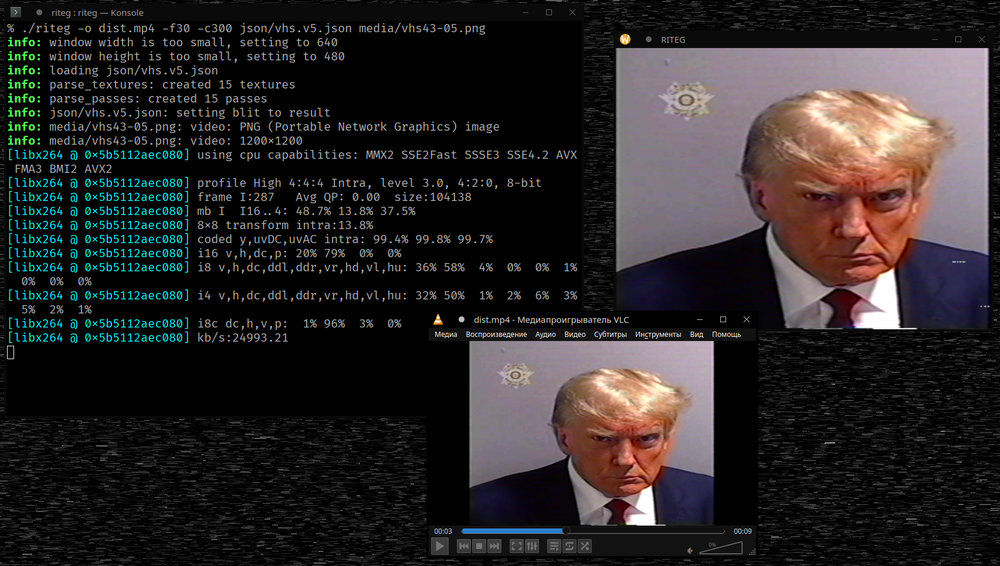
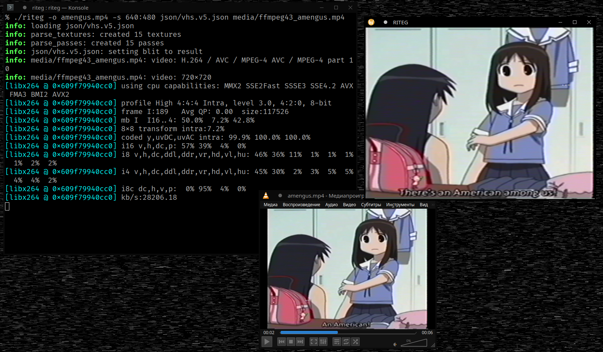

# Command-line usage
```
usage: riteg [-h] [-o <path>] [-s <w>:<h>] [-f <fps>] [-c <count>] <pipeline> [paths...]
options:
   -h          : print this message and exit
   -o <path>   : specify output path. FFmpeg path formatting works.
   -s <w>:<h>  : specify rendering frame size.
   -f <fps>    : specify fixed framerate (frametime = 1 / FPS).
   -c <count>  : specify maximum amount of frames to export.
```

### Example: dry-run pipeline output
```
riteg json/vhs.v5.json
```



### Example: simple image input
```
riteg json/vhs.v5.json media/vhs43-05.png
```



### Example: single-image export
**NOTE:** it displays an error message because FFmpeg has a hard time comprehending the fact that it is being abused into per-single-image processing.  

```
riteg -o test.png json/vhs.v5.json media/vhs43-05.png
```



### Example: multiple-image export
```
mkdir -p dist
riteg -o dist/%04d.png -f30 -c300 json/vhs.v5.json media/vhs43-05.png
```



### Example: video container export
```
riteg -o dist.mp4 -f30 -c300 json/vhs.v5.json media/vhs43-05.png
```



### Example: video container processing
```
riteg -o amengus.mp4 -s 1280:960 json/vhs.v5.json media/ffmpeg43-amengus.mp4
```



### FFmpeg pathnames
The library (as of now) uses FFmpeg libraries to read and write image data. Paths with image sequences can be formatted using `%d` subset of `sprintf` format specification.
