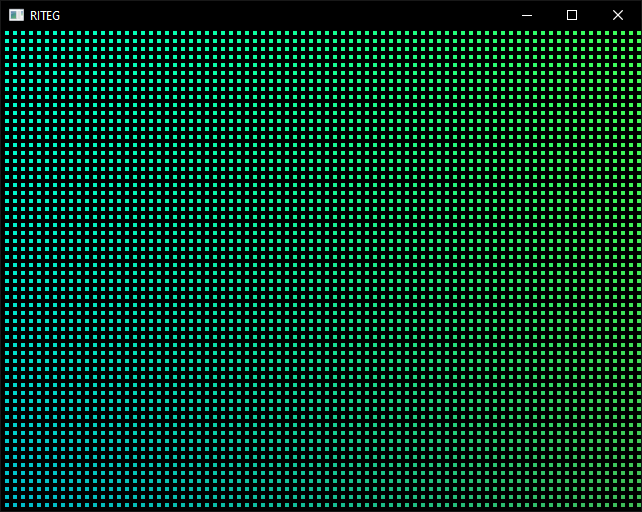

# RITEG.V2 projects

Unlike V1's JSON and initial V2's TOML, the new V2 (or V25) uses a more programmer-friendly approach and runs as a minimal Lua runtime.  

## Example project
```lua
-- This shader is directly copypasted from a new shader
-- page on Shadertoy: https://www.shadertoy.com/new
local example = riteg.create_shader(640, 480, [[
    void mainImage(out vec4 fragColor, in vec2 fragCoord)
    {
        // Normalized pixel coordinates (from 0 to 1)
        vec2 uv = fragCoord / iResolution.xy;

        // Time varying pixel color
        vec3 col = 0.5 + 0.5 * cos(iTime + uv.xyx + vec3(0.0, 2.0, 4.0));

        // Output to screen
        fragColor = vec4(col, 1.0);
    }
]], { iChannel0 = riteg.get_image_source() })

-- This shader is directly copypasted from my Shadertoy
-- account: https://www.shadertoy.com/view/4cf3W8
local pixelize = riteg.create_shader(640, 480, [[
    #define BLOCK_WIDTH     8.0
    #define BLOCK_HEIGHT    8.0
    #define SIZE_RATIO_X    0.5
    #define SIZE_RATIO_Y    0.5

    #define BACKGROUND vec4(0.0, 0.0, 0.0, 0.0)

    void mainImage(out vec4 fragColor, in vec2 fragCoord)
    {
        vec2 pixel = 1.0 / iResolution.xy;

        vec2 uv = vec2(0.0, 0.0);
        uv.x = BLOCK_WIDTH * pixel.x * floor(fragCoord.x / BLOCK_WIDTH);
        uv.y = BLOCK_HEIGHT * pixel.y * floor(fragCoord.y / BLOCK_HEIGHT);

        float gap_width = BLOCK_WIDTH * (1.0 - SIZE_RATIO_X);
        float gap_height = BLOCK_HEIGHT * (1.0 - SIZE_RATIO_Y);
        
        float mod_x = mod(fragCoord.x, BLOCK_WIDTH);
        float mod_y = mod(fragCoord.y, BLOCK_HEIGHT);

        vec4 color = vec4(0.0, 0.0, 0.0, 0.0);
        for(float i = 0.0; i < BLOCK_WIDTH; i += 1.0)
        for(float j = 0.0; j < BLOCK_HEIGHT; j += 1.0)
            color += texture(iChannel0, uv + pixel * vec2(i, j));
        color /= BLOCK_WIDTH * BLOCK_HEIGHT;

        if((mod_x <= gap_width) || (mod_y <= gap_height))
            fragColor = BACKGROUND;
        else fragColor = color;
    }
]], { iChannel0 = example })

riteg.set_display_source(pixelize)
```

## Running the project
```
riteg project/example.lua
```

  

## Lua API
- `riteg.has_option(option)` Returns `true` when command line contains an option  
- `riteg.get_option_number(option, fallback)` Returns a numeric value of an option's argument or a fallback value if there is no option or the option doesn't posess an argument  
- `riteg.get_option_string(option, fallback)` Returns a string value of an option's argument or a fallback value if there is no option or the option doesn't posess an argument  
- `riteg.get_blank_source()` Returns a source ID for a blank (black) texture  
- `riteg.get_image_source()` Returns a source ID for a loaded image. If there is no image, the function falls back to using the blank texture  
- `riteg.create_shader(width, height, source[, channels])` Returns a source ID for a newly created shader that renders into a texture of `width`x`height` and assigns channels (`iChannel0`, `iChannel1`, `iChannel2` and `iChannel3`) to specific source IDs  
- `riteg.set_output_source(source_id)` Sets the source to be used for writing an image using a specified saver implementation  
- `riteg.set_display_source(source_id)` Sets the source to be used for displaying an image on the window. When not ever called, defaults to using the output source for that purpose  
