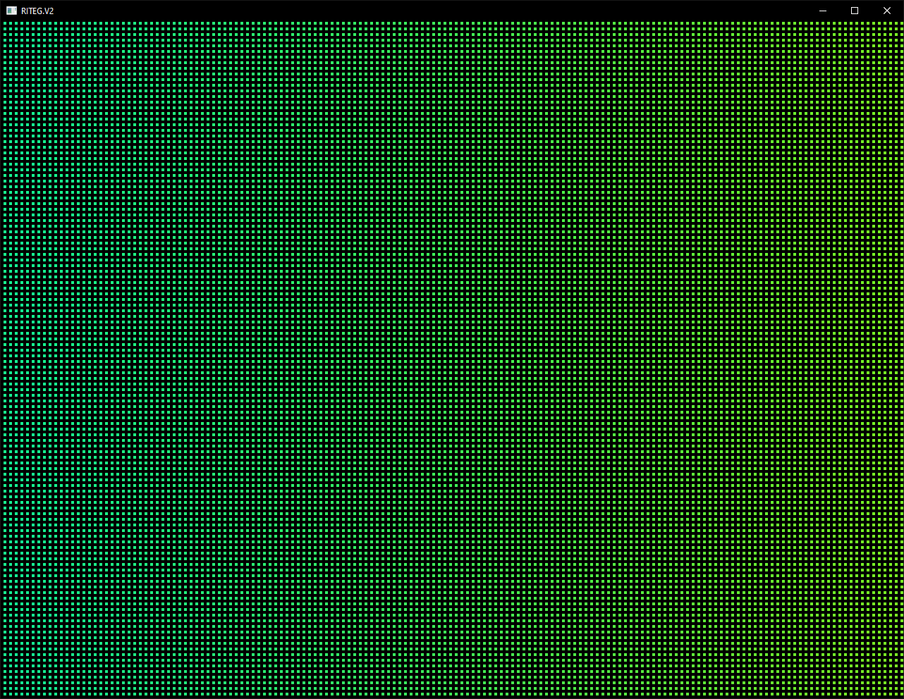

# Shadertoy compatibility

RITEG.V2 is designed to be _almost_ compatible with [Shadertoy](https://www.shadertoy.com/) shaders. In fact, [here's an example of a pipeline that has been directly copy-pasted from RITEG](https://www.shadertoy.com/view/43GfWK)  

  

  

## Stub uniforms
- `iMouse` is always filled with zero values as if the host machine had no mouse attached while running Shadertoy in browser  
- `iDate` is always filled with zero values as if it was day 00 of month 00 of year 0000  

## RITEG extensions
- There is a `#define RITEG 1` macro present  
- If the `RITEG` macro is defined, there is an additional uniform 16-float array named `iParam`  

```glsl
#ifdef RITEG
#define BLOCK_WIDTH     iParam[0]
#define BLOCK_HEIGHT    iParam[1]
#define SIZE_RATIO_X    iParam[2]
#define SIZE_RATIO_Y    iParam[3]
#else
#define BLOCK_WIDTH     8.0
#define BLOCK_HEIGHT    8.0
#define SIZE_RATIO_X    0.5
#define SIZE_RATIO_Y    0.5
#endif
```
