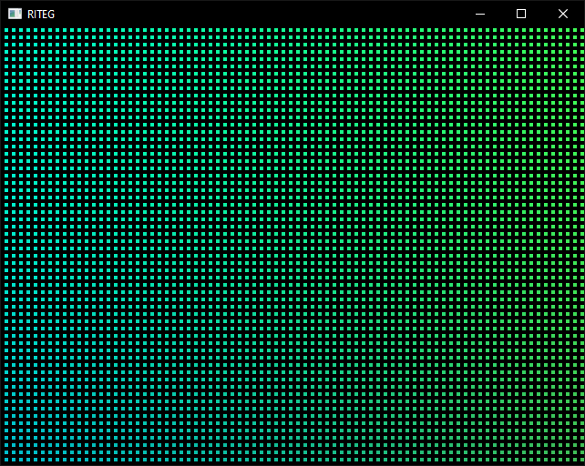
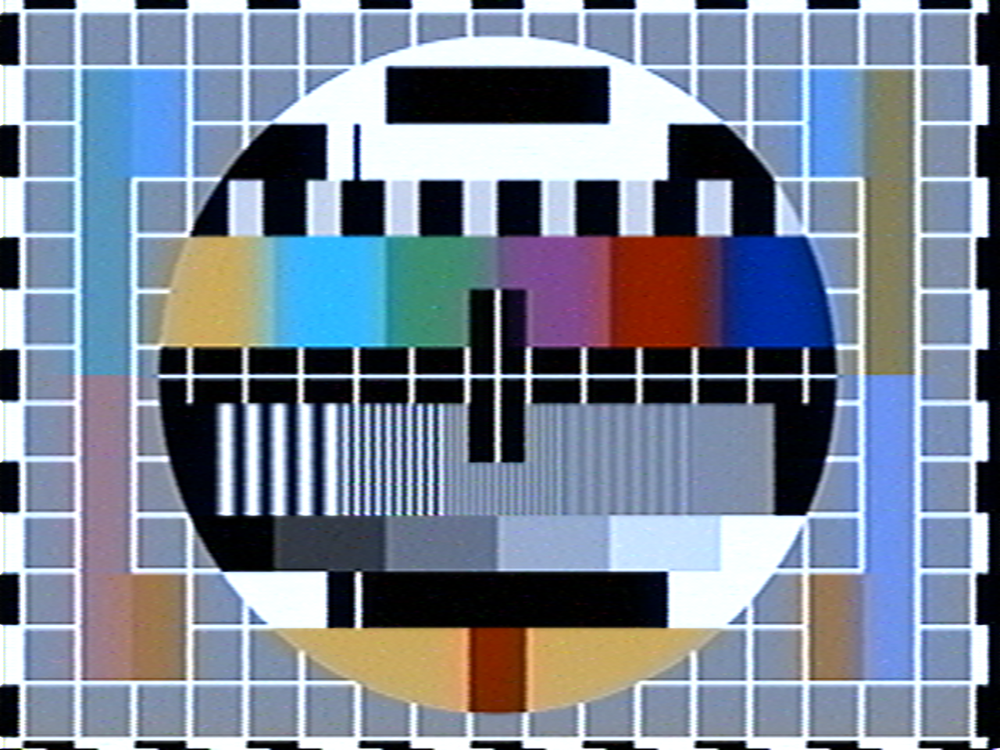
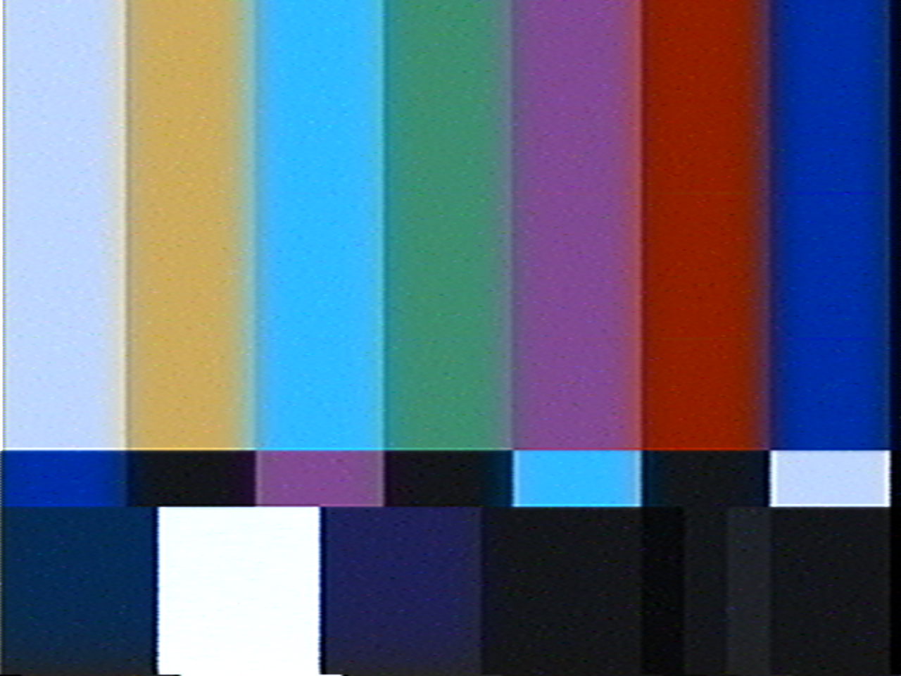
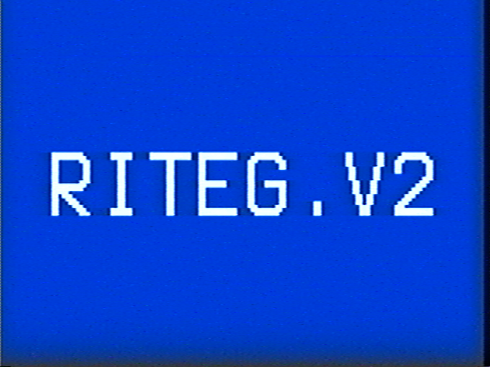
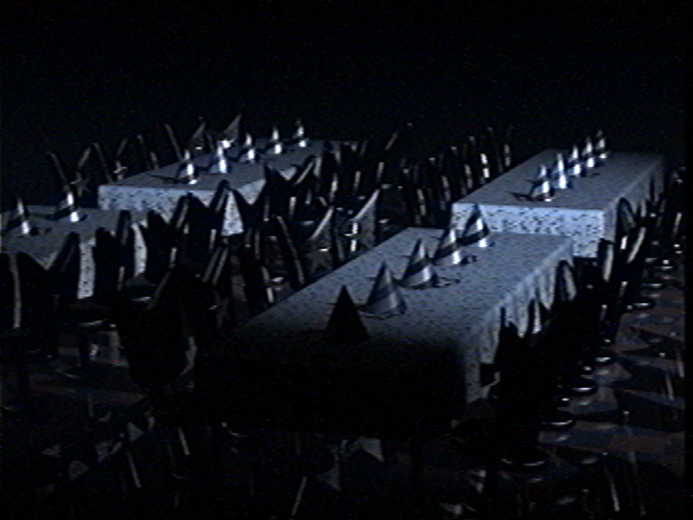
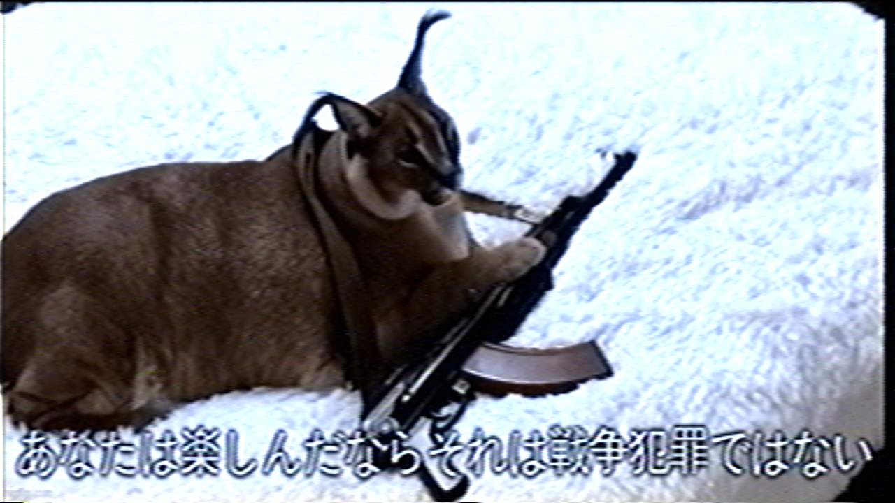
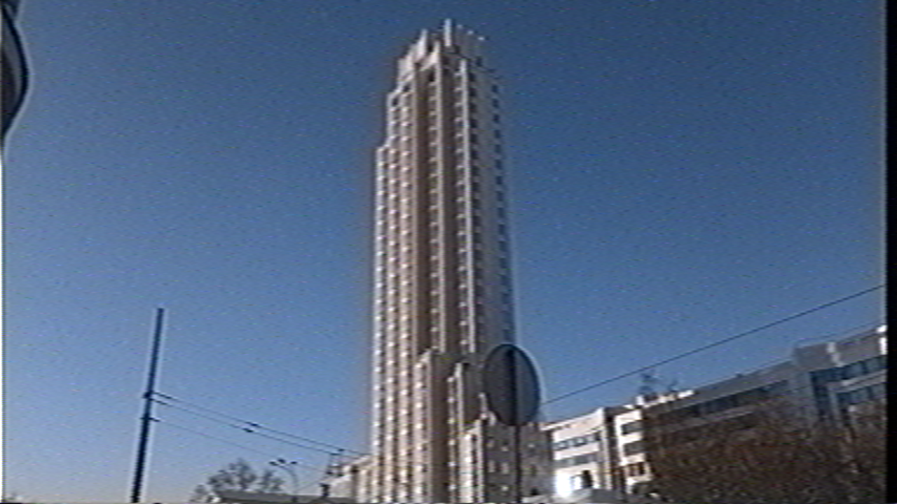

# RITEG.V2
RITEG stands for Real-time-ish Image Translation enhanced with GLSL  

* [YouTube VHS effect (VHS.V2) demo](https://www.youtube.com/watch?v=AqyeJKgVvjk)  

    

* [YouTube VHS effect (VHS.V3) demo](https://www.youtube.com/watch?v=YYPVdMJoNWc)  

    

# Example: Shadertoy compatibility
  

# Example: VHS 4:3 (video)
<video width="640" height="480" controls>
  <source src="project.vhs43.01.mp4" type="video/mp4">
</video>

# Example: VHS 4:3
  
  
  
  
  

# Example: VHS 16:9
  
  
  
  
  
  
