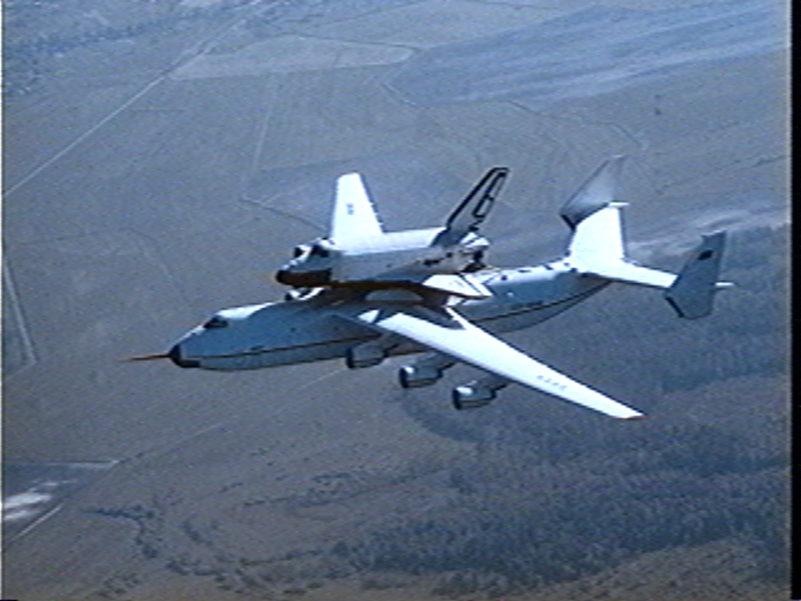

# RITEG.V2
RITEG stands for Real-time-ish Image Translation enhanced with GLSL  

* [YouTube VHS effect (VHS.V2) demo](https://www.youtube.com/watch?v=AqyeJKgVvjk)  

    

* [YouTube VHS effect (VHS.V3) demo](https://www.youtube.com/watch?v=YYPVdMJoNWc)  

    

# Example: Shadertoy compatibility
  

# Example: VHS 4:3
  
  
  
  
  
